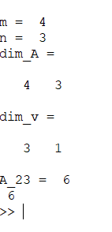
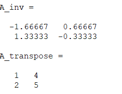

### Key takeaways in WEEK 1

1. what is machine learning

2. Supervised Learning
Regression and classification

3. Unsupervised learning 
Cocktail party problem
    used to deferrentiate between sounds

4. cost function and minimising it graphically represented

5. contour plots, the circle in contour plots represent that the value of the points is
The inner most circle has the least error.

6. Gradient descent and gradient descent over linear regression
batch gradient descent where the entire dataset is used.

7. Matrices introduction

Running first code in octave:

8. Matrix operations,addition scalar and matrixmultiplication.
prediction = data matrix * parameters
Properties not commutative, is associative,
identity matrix

9. Inverse of a matrix
A.(A^-1) = A^-1.A = I
matrix transpose 

