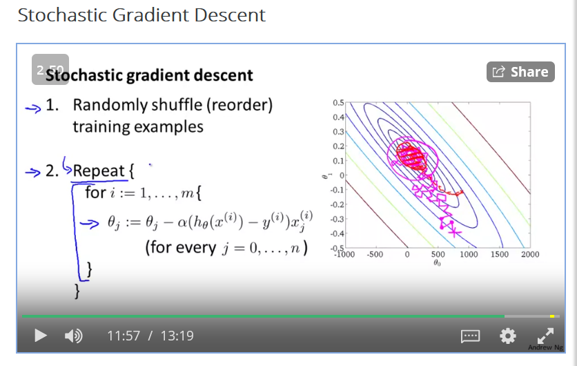
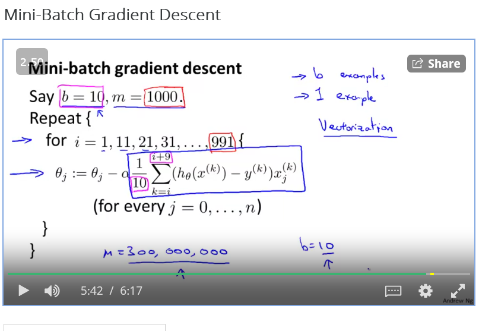
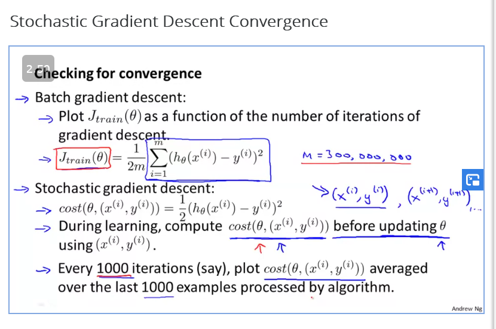
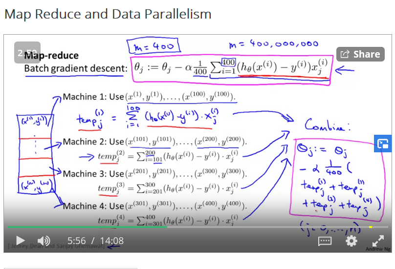

# Learning with large datasets

More data means better performance
Inorder to verify this plot a learning curve for  rangeof values of m and veriify that the algorithm has high variance when m is small

ONly when we very that variance is high do we go for adding more data

## Stochastic Gradient Descent algorithm

Evaluating cost function on one example at a time

## Mini batch Gradient Descent algorithm
Evaluating cost function over 10 examples at a time

## Checking for convergence

Since we can check cost over small iteration over dataset we can for example say that we compute cost over 1000 examples.

If the igraph grows at the other end then we need to use a smaller alpha because that means its diverging

We can decrease alpha over time to imporve the convergence
For example :
const1/(iterationNmber + const2)

## Online Learning

If we have a continuos streamof example then we can simply use stochastic gradient descent over a single data point and discarding the rest of the parameters.

Predicting click through rate throughusing the query serach algorithm user inputs the query and the result that is shown if the user click then y=1 otherwise =0

## Map reduce

Using batch gradient descent to iterat over the dataset usually deviding the training ovver computers

When the bulk of data set is computed over sum map reduce can be used.

It can also be used over multi cores.

Each machine in the array, computes forward propagation and back propagation on 1/10 of the data to compute the derivative with respect to that 1/10 of the data.

No exercises in week 10.
 