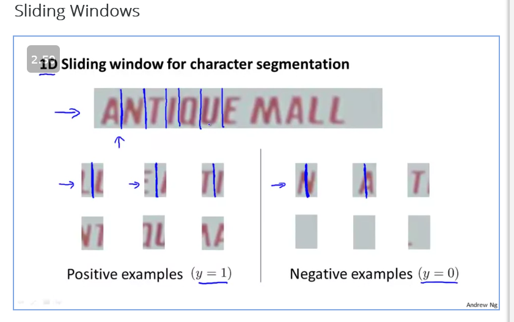
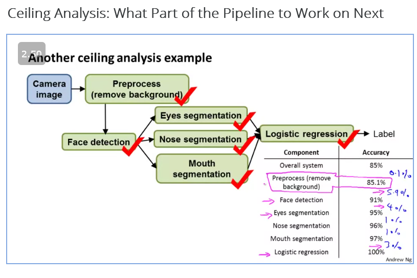

## Problem Description and Pipeline

Text detection
Character segmentation
Character recognition

## sliding Windows

Illustrated using a pedestrian recognition
SUpervised learning : through taking a rectangular region and then shifting the slider over the entire image. 
And then run it with a bigger sliding window.

sliding window for text segmentation:

## Getting Lots of Data and artificial data

For example in text classification we canuse fonts and put it in a backgroundwith noise to create a dataset

We can also distort the image through warping

If we duplicate data items inlinear regression we will still end up with same value of theta

Checklist:

1. Ensure you have a low bias classifier

## Ceiling Analysis : whwatpart of pipeline to work on next

understanding which partof the pipeline has the most effect on the entire process.

