## Multivariate  linear regression

1. Multiple x variables for a single y.
we take x0 as 1

2. Gradient descent for multiple variables
Refer to notebook.

conveniently gradient descen t for multiple variables also comes to the same formula

`thetaj = thetaj - sigma 1tom ((sigma 0ton (thetai*xi) - yj)^2) * xj`

3. IMportance of featur scaling we need to make sure that all features are of the same scale otherwise it willl take a long time to converge to the local minimum

rule of thumb is that the features scale must be between -1 and 1

for that either you can  do feature scaling which is simply deviding values by range

or Mean normalisation 
`x1 = x1 - u1/ s1`
where u1 is the averagevalue of xin the training set
and s1 is the range max - min or the standard deviation
 Mean normalisation also results with changing the mean of the x values as zero

 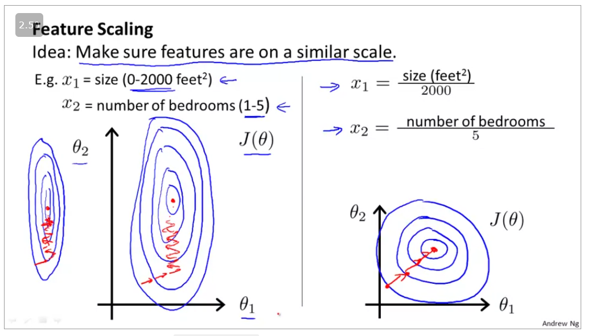

4. Debuggin the gradient descent 
plot the cost function with the numbe rof iterations
ifthe curve y is going down then its good itherwise iterations are not helping the gradient descent to converge.

If its not converging then make sure you take a smaller value of alpha or your function is just wrong

Feature and polynomial regression

Combining features 

Polynomial regression
`h thetax = theta0 + theta1*x + theta2 *x^2 + theta3 * x^3 ...`

One important thing to keep in mind is, if you choose your features this way then feature scaling becomes very important.

eg. if x1x_1x1​ has range 1 - 1000 then range of x12x_1^2x12​ becomes 1 - 1000000 and that of x13x_1^3x13​ becomes 1 - 1000000000

5. Normal Equation

NOmral equation is a one shot way  of finding the minimum of gradient equation.

in ocatve it is writtenas pinv(X' * X) * X' * y

feature scaling isnt necessary when using normal equation
because you guessed it .. its oneshot.

However all is not so rosy , normal equation is size prohibitive, it takes a lot of time to compute with the  time complexity of O(n^3)

6. It very difficult for (X.T X)^-1 to be non invertible

however if thats the case then remove the redundant features

ir there might be too many features my friend (m<=n>)
or use regularisation (to be explained)

question to review in the quiz:
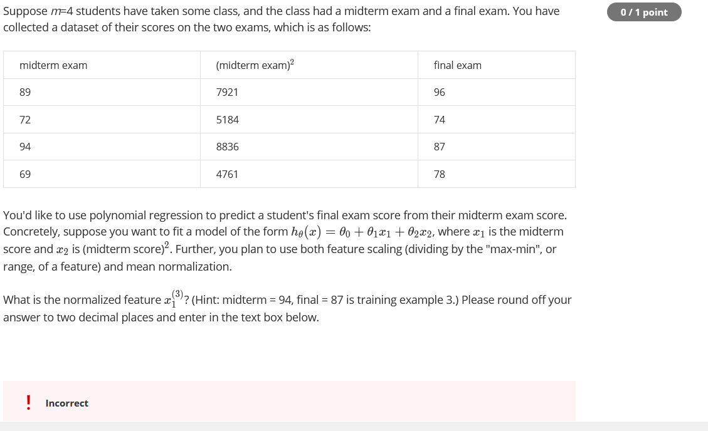

## Octave tutorial

~ is not in octave
using  a semicolon supresses the output

disp(sprintf('2 decimals: %0.2f', a))
prints a upto 2 decimal places

v = 1:0.1:2 

gets us a vector from 1 to 2 with increment of 1

V= 1:6 

generates number from 1 to 6

ones(2, 3)
generates 2 x 3 maatrix of 1

zeros(1,3)
generates 0 vector of size 1 X 3

rand(3,3)
givs a random number from 0 to 1

randn(1,3) 
gives a random number from a gaussian distribution

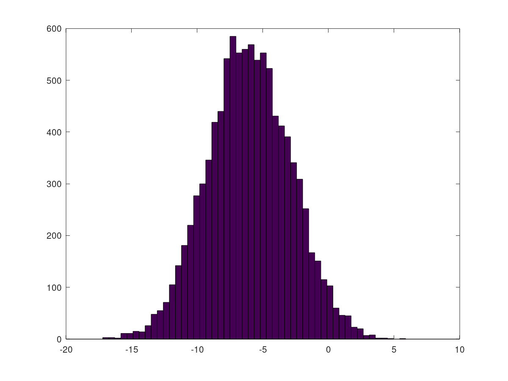

identity function
eye(1,3)

X=load('featuresX.dat)

To look at variables in current scope we have 
who command
whos gives the details

slices
v = priceY(1:10)

save hello.mat v

this will save the variable vto a file named hello.mat

clear - will clear all the variablesin scope

A (3,2)
A[3,2]

A(2,:)
A[2,:]

A([1 3],  :)
get everything from the rows 1,2 and 3

A(:)
gives all the vectors

multiplying magic matrix by a unitary matrix

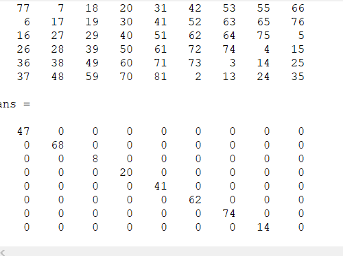

### Plotting data
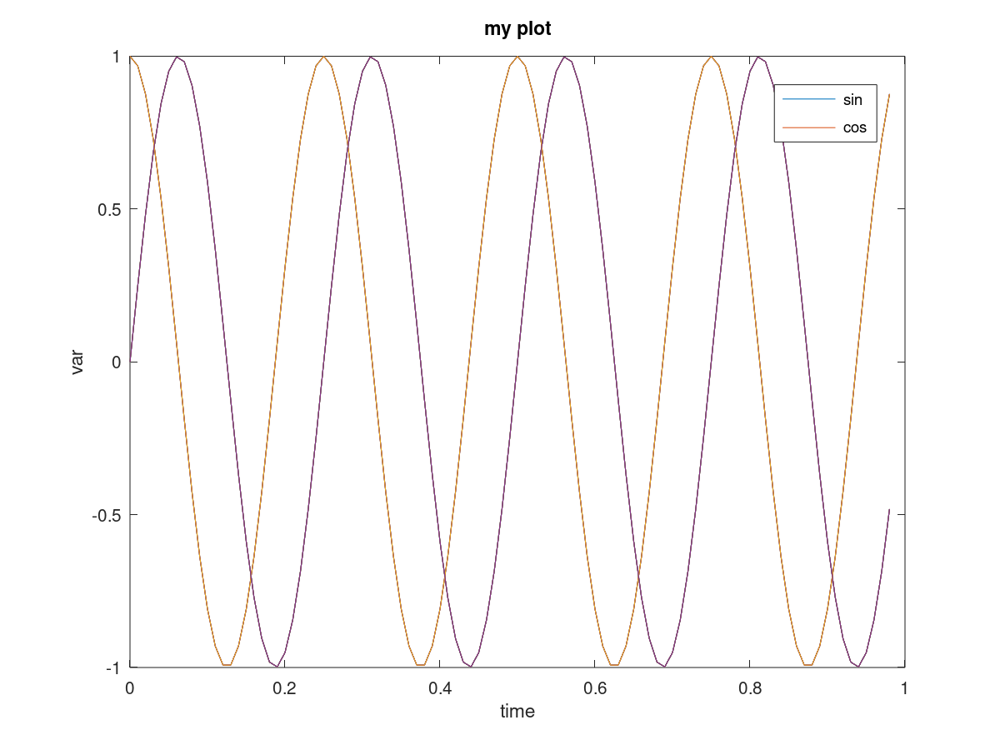

magicsquare of 5
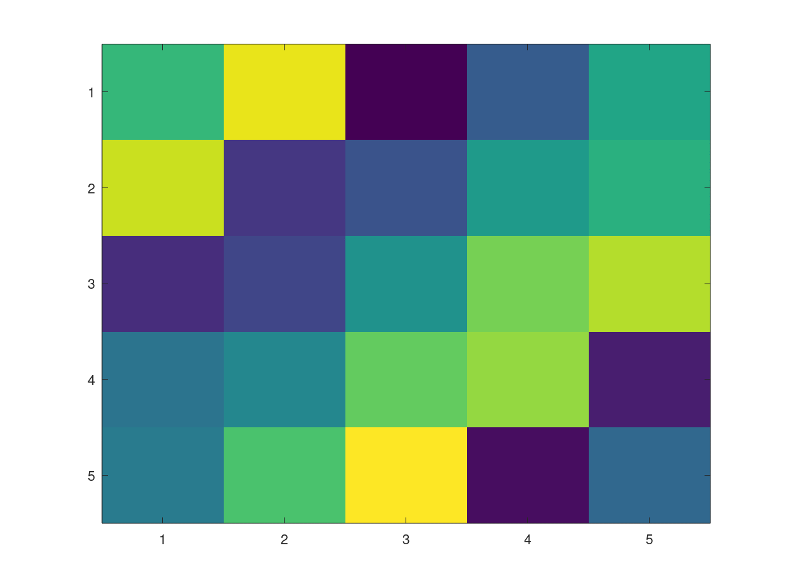

bigger one
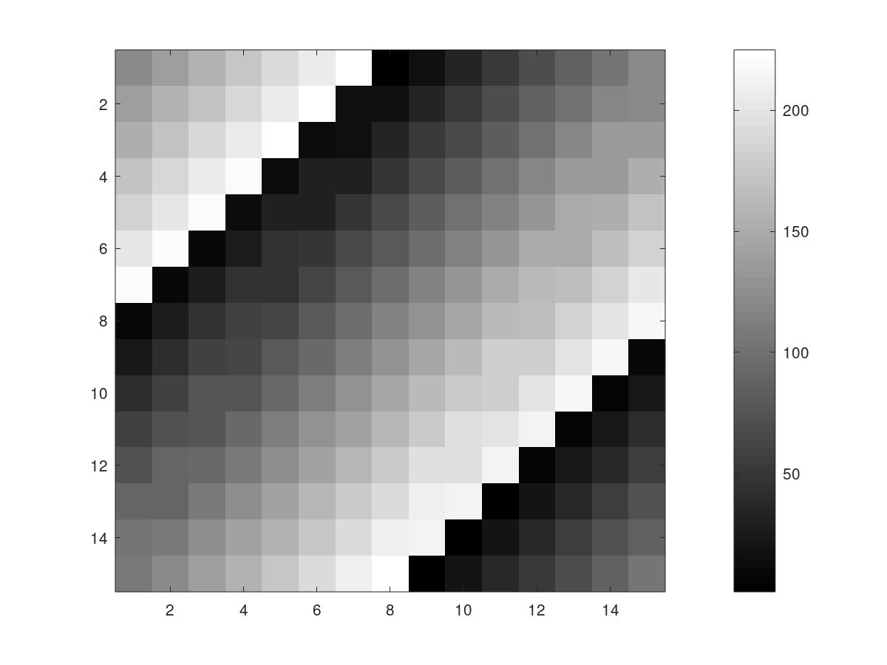

### Cost function in octave
Result:
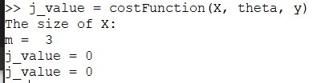

### vectorisation 

Creating vectors instead of using for loop

# Exercise :
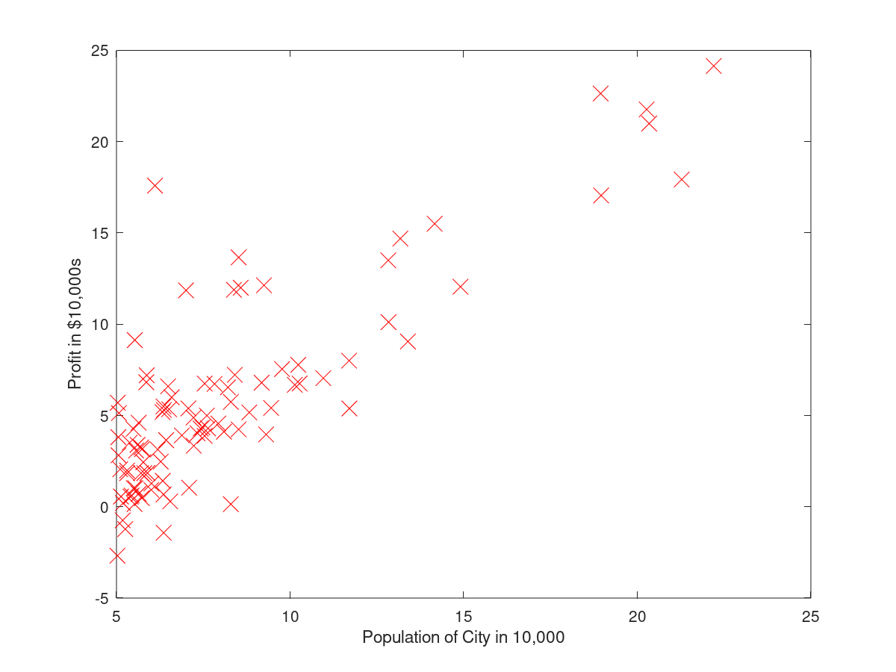

We store each example as a row in the the X
matrix in Octave/MATLAB. To take into account the intercept term (θ0),
we add an additional first column to X and set it to all ones. This allows
us to treat θ0 as simply another ‘feature’

for x^y, only square matrix arguments are permitted
 and one argument must be scalar.  Use .^ for elementwise
power.

make sure you understand what you are trying to optimize and what is being updated. Keep in mind that the cost J(θ) is parameterized by the vector θ, not X and y. That is, we minimize the value of J(θ)
by changing the values of the vector θ, not by changing X or y.

A*B does a matrix
multiply, while A.*B does an element-wise multiplication.

The regression line
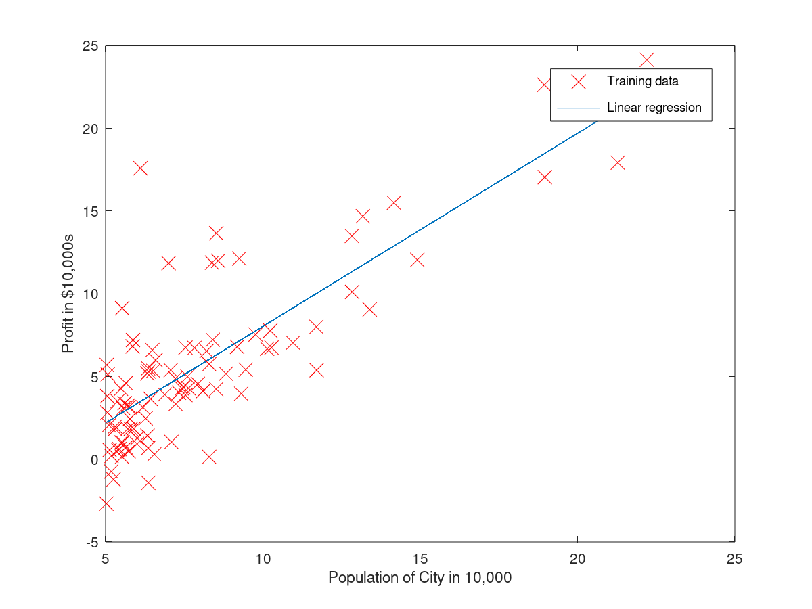

The cost updation function:
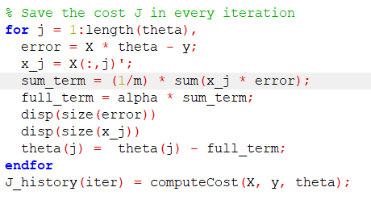

My doubt how come the way I write the operator matters so much. Intuitively it shouldnt.

The visualisation:
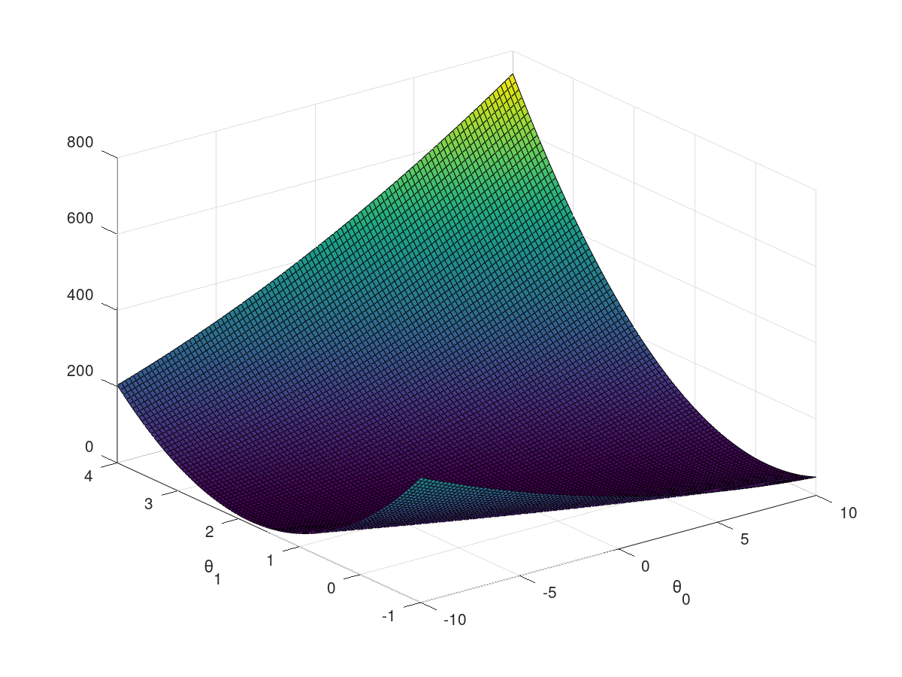
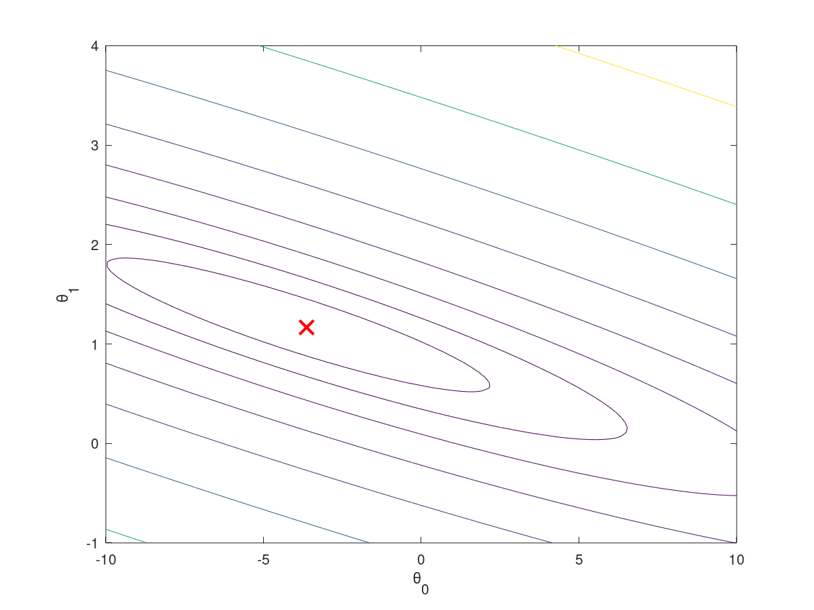

The exercise giving error:
 Sorry, your answer was incorrect. Hint: For gradient de
scent, we need to implement simultaneous updates for all v
alues in theta.

The cost function for multi
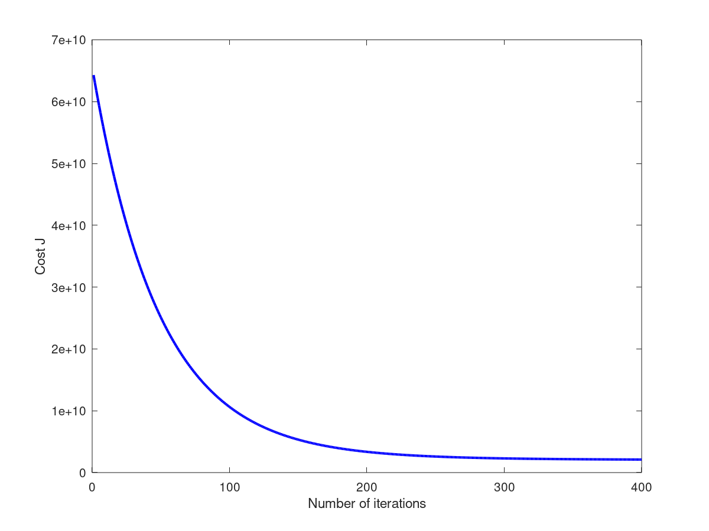

