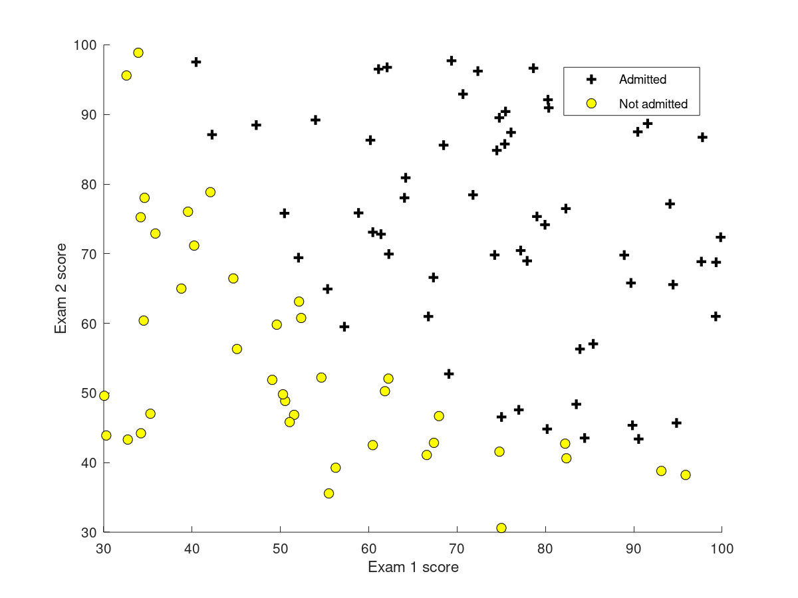
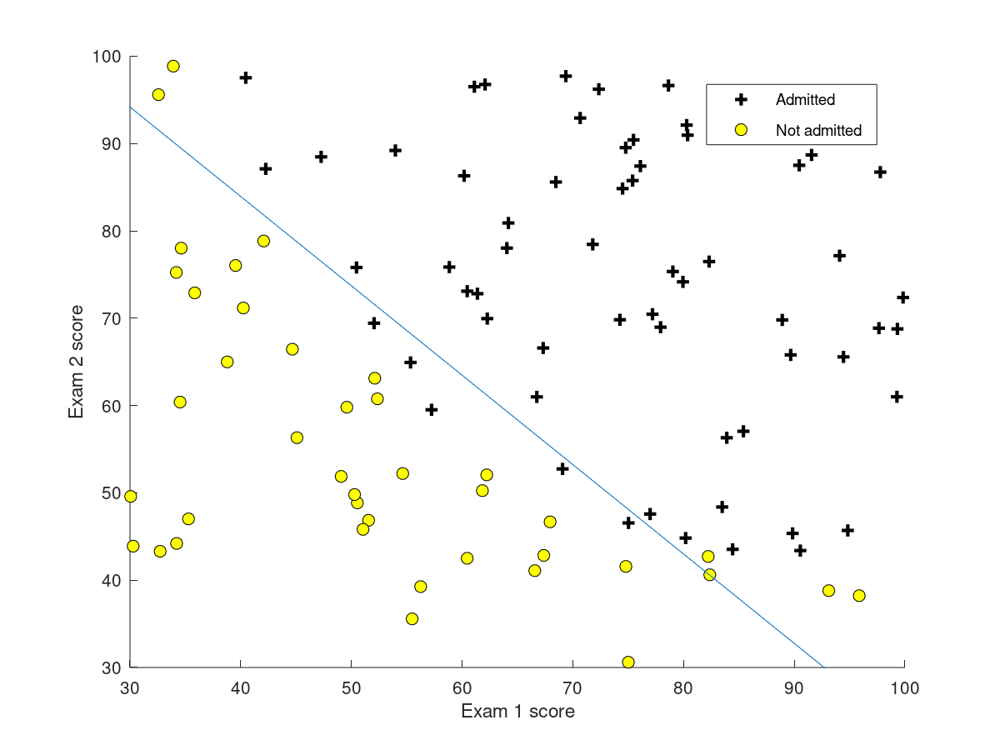

## The need of logistic regression

Logistic regresssion is required mainly because linear regression cannot be used for classifcation because of following reason.

Logistic hypothesis:

Since logistic regression always outputs a probability, we assume if the h(x) >= 0.5 or less than 0.5

Creating decision boundary through g(z) >0 :

Non linear decision boundary

cost function:

finding cost function

plotting it
Plot J(θ)=−1m∑i=1m[y(i)log⁡hθ(x(i))+(1−y(i))log⁡(1−hθ(x(i)))]J(\theta) = -\frac{1}{m}\sum_{i=1}^{m}[y^{(i)}\log h_\theta(x^{(i)}) + (1-y^{(i)})\log(1-h_\theta(x^{(i)}))]J(θ)=−m1​∑i=1m​[y(i)loghθ​(x(i))+(1−y(i))log(1−hθ​(x(i)))] as a function of the number of iterations and make sure J(θ)J(\theta)J(θ) is decreasing on every iteration.

A vectorized implementation is:

θ:=θ−αmXT(g(Xθ)−y⃗)\theta := \theta - \frac{\alpha}{m} X^{T} (g(X \theta ) - \vec{y})θ:=θ−mα​XT(g(Xθ)−y
​)

choosing an optimisation algorithm
is of importance

In multiclass classification : one vs all 
we select on class and see its probability agains t others.

ans then to make prediction we choose the max value of the hypothesis function.

Exercise

## overfitting
Is when the model fits the training data too perfectly

reducing feeatures
regularisation

## regularisation
adding a term to the cost function that penalisesfor usinglarge value of theta

 X is non-invertible if m < n, and may be non-invertible if m = n.

## normal equation

Next video:
https://www.coursera.org/learn/machine-learning/lecture/68Pol/multiclass-classification-one-vs-all

### fminunc function
Function File: fminunc (fcn, x0)
Function File: fminunc (fcn, x0, options)
Function File: [x, fval, info, output, grad, hess] = fminunc (fcn, …)

    Solve an unconstrained optimization problem defined by the function fcn.

    fcn should accept a vector (array) defining the unknown variables, and return the objective function value, optionally with gradient. fminunc attempts to determine a vector x such that fcn (x) is a local minimum.

    x0 determines a starting guess. The shape of x0 is preserved in all calls to fcn, but otherwise is treated as a column vector.

    options is a structure specifying additional options. Currently, fminunc recognizes these options: "FunValCheck", "OutputFcn", "TolX", "TolFun", "MaxIter", "MaxFunEvals", "GradObj", "FinDiffType", "TypicalX", "AutoScaling".

    If "GradObj" is "on", it specifies that fcn, when called with 2 output arguments, also returns the Jacobian matrix of partial first derivatives at the requested point. TolX specifies the termination tolerance for the unknown variables x, while TolFun is a tolerance for the objective function value fval. The default is 1e-7 for both options.

    For a description of the other options, see optimset.

    On return, x is the location of the minimum and fval contains the value of the objective function at x.

    info may be one of the following values:

    1

        Converged to a solution point. Relative gradient error is less than specified by TolFun.
    2

        Last relative step size was less than TolX.
    3

        Last relative change in function value was less than TolFun.
    0

        Iteration limit exceeded—either maximum number of algorithm iterations MaxIter or maximum number of function evaluations MaxFunEvals.
    -1

        Algorithm terminated by OutputFcn.
    -3

        The trust region radius became excessively small. 

    Optionally, fminunc can return a structure with convergence statistics (output), the output gradient (grad) at the solution x, and approximate Hessian (hess) at the solution x.

    Application Notes: If have only a single nonlinear equation of one variable then using fminbnd is usually a better choice.

    The algorithm used by fminsearch is a gradient search which depends on the objective function being differentiable. If the function has discontinuities it may be better to use a derivative-free algorithm such as fminsearch. 

# Exercises

Plotting X and Y

How to deal with NaN in cost fucntion
Just use prediction function instead of directly using X * theta

Decision bounday

