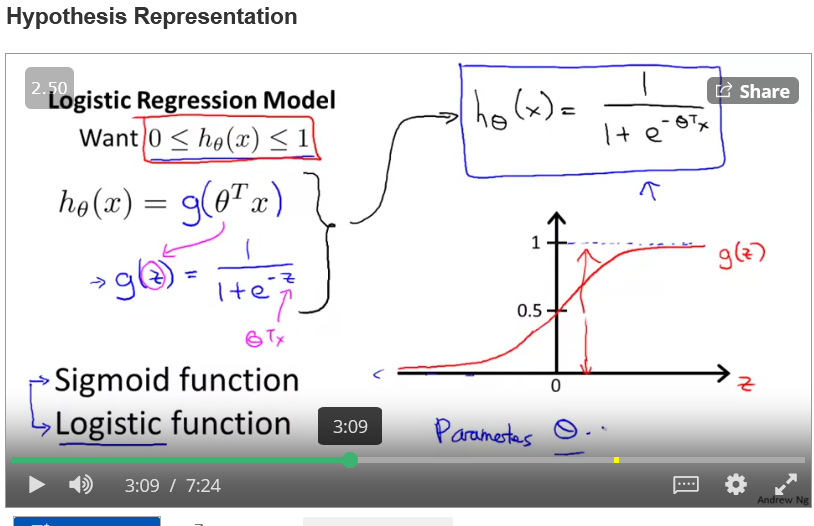
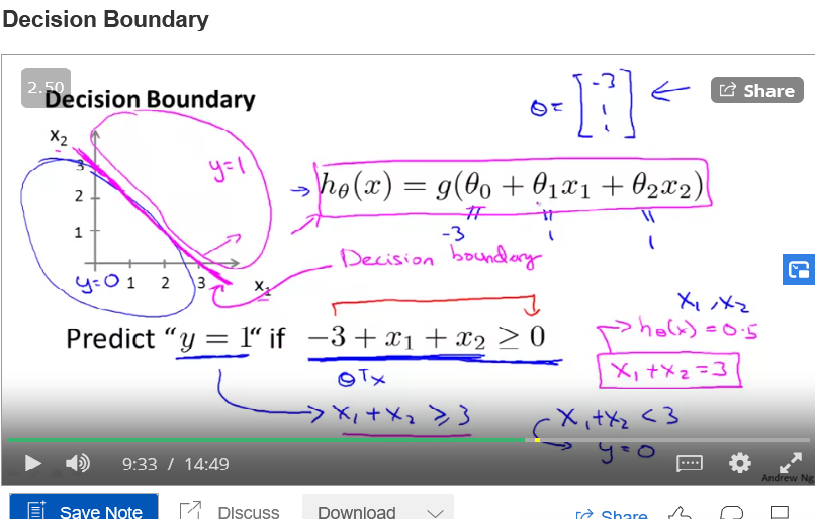
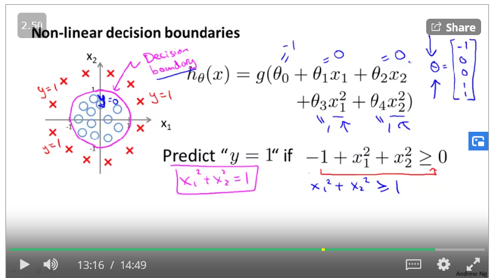
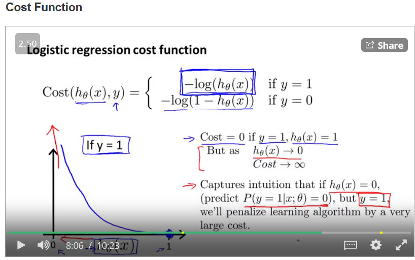
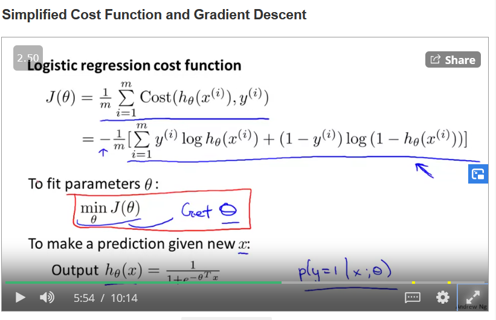
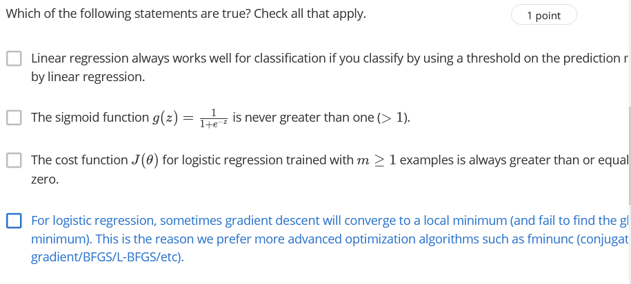
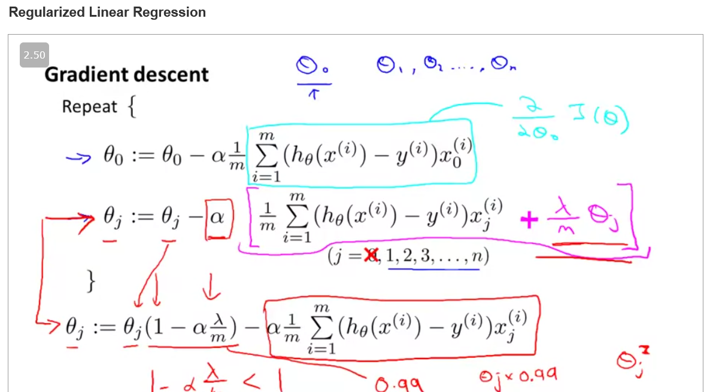

## The need of logistic regression

Logistic regresssion is required mainly because linear regression cannot be used for classifcation because of following reason.

Logistic hypothesis:

Since logistic regression always outputs a probability, we assume if the h(x) >= 0.5 or less than 0.5

Creating decision boundary through g(z) >0 :

Non linear decision boundary

cost function:

finding cost function

plotting it
Plot J(θ)=−1m∑i=1m[y(i)log⁡hθ(x(i))+(1−y(i))log⁡(1−hθ(x(i)))]J(\theta) = -\frac{1}{m}\sum_{i=1}^{m}[y^{(i)}\log h_\theta(x^{(i)}) + (1-y^{(i)})\log(1-h_\theta(x^{(i)}))]J(θ)=−m1​∑i=1m​[y(i)loghθ​(x(i))+(1−y(i))log(1−hθ​(x(i)))] as a function of the number of iterations and make sure J(θ)J(\theta)J(θ) is decreasing on every iteration.

A vectorized implementation is:

θ:=θ−αmXT(g(Xθ)−y⃗)\theta := \theta - \frac{\alpha}{m} X^{T} (g(X \theta ) - \vec{y})θ:=θ−mα​XT(g(Xθ)−y
​)

choosing an optimisation algorithm
is of importance

In multiclass classification : one vs all 
we select on class and see its probability agains t others.

ans then to make prediction we choose the max value of the hypothesis function.

Exercise

## overfitting
Is when the model fits the training data too perfectly

reducing feeatures
regularisation

## regularisation
adding a term to the cost function that penalisesfor usinglarge value of theta

 X is non-invertible if m < n, and may be non-invertible if m = n.

## normal equation

Next video:
https://www.coursera.org/learn/machine-learning/lecture/68Pol/multiclass-classification-one-vs-all