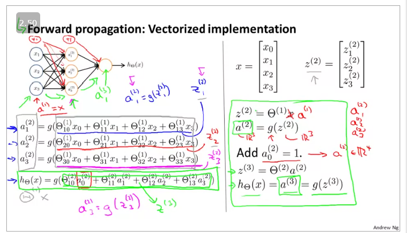
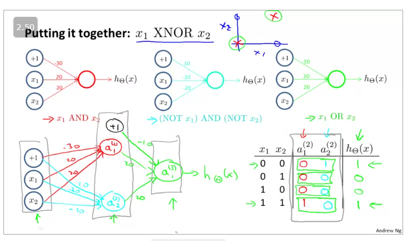
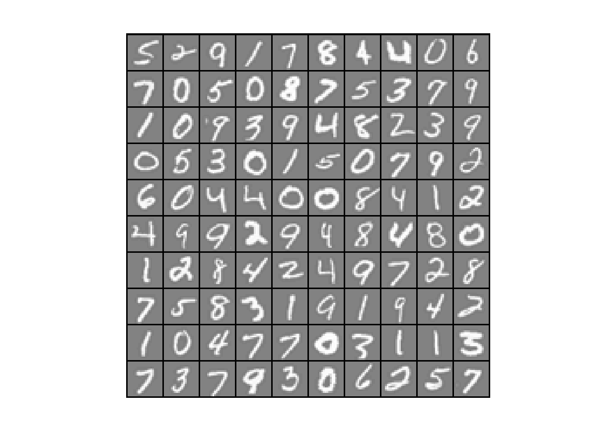
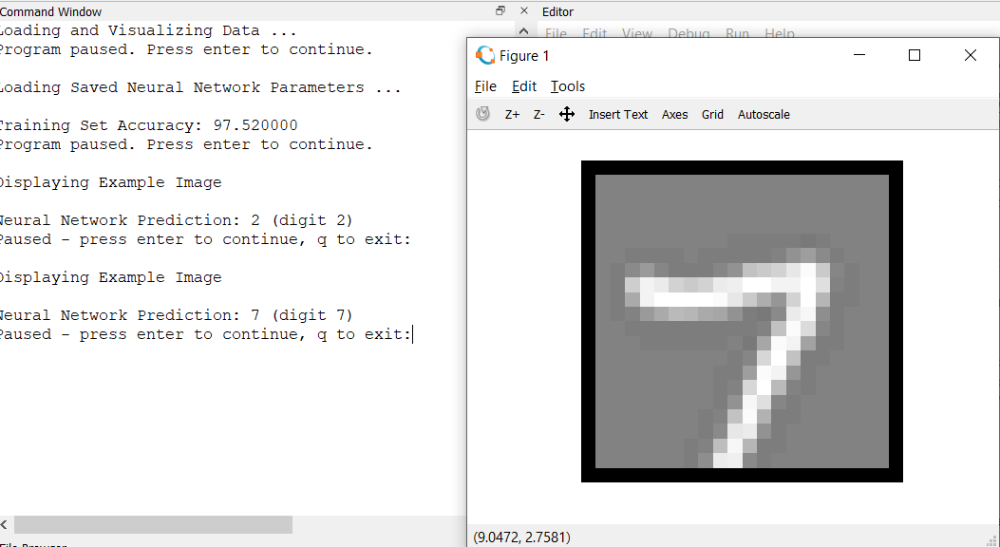

## Non- Linear classification

It is hard to classify 
If you use logistic regresssion,
choose too few features hten youll underfit
and use too many then youll overfit

specially in case of computer vision. so we need to come up with something better

## Neurons and the Brain

So we have developed neural network modelling how brain works by feedbacks through our senses which goes to the braon

## Model representation I

If network has S(j) units in layer j, S(j+1) units in layer j + 1, then theta(j) will be of dimension S(j+1) X (S(j) + 1)

## Model Representation II

z(j)=Θ(j−1)a(j−1)

hΘ​(x)=a(j+1)=g(z(j+1))

## Examples and intuition I

In this we are toldabout considering a neural network that solves for a boolean function.

## Examples and intuition II

 The algebraic expressions ( A + B ¯ ) ⋅ ( A ¯ + B ) {\displaystyle (A+{\overline {B}})\cdot ({\overline {A}}+B)} {\displaystyle (A+{\overline {B}})\cdot ({\overline {A}}+B)} and A ⋅ B + A ¯ ⋅ B ¯ {\displaystyle A\cdot B+{\overline {A}}\cdot {\overline {B}}} {\displaystyle A\cdot B+{\overline {A}}\cdot {\overline {B}}} both represent the XNOR gate with inputs A and B. 

 ## Multiclass classification

one vs all model where the answer y one of the vectors.

# Exercise

Digits we need to classify:

The cost functiondone. Predict function remains.
 Difficulty in prediction of one vs all

neural network result:
