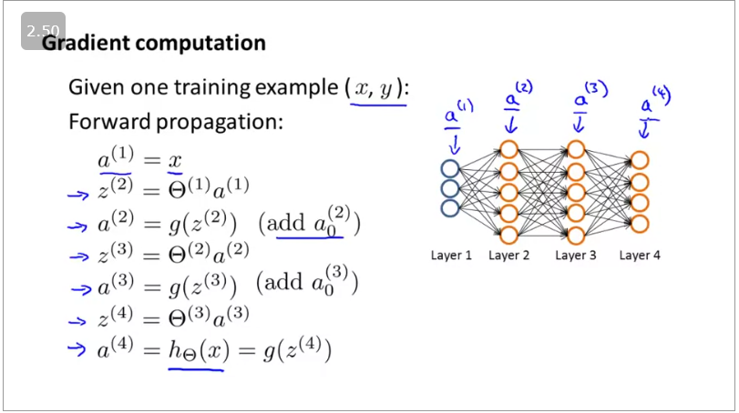

# Neural Network Learning

Training a multiclass neural network. 

Neural net cost:

## Cost function

Let's first define a few variables that we will need to use:

    L = total number of layers in the network
    sls_lsl​ = number of units (not counting bias unit) in layer l
    K = number of output units/classes

Recall that in neural networks, we may have many output nodes. We denote hΘ(x)kh_\Theta(x)_khΘ​(x)k​ as being a hypothesis that results in the kthk^{th}kth output. Our cost function for neural networks is going to be a generalization of the one we used for logistic regression. Recall that the cost function for regularized logistic regression was:
J(θ)=−1m∑i=1m[y(i) log⁡(hθ(x(i)))+(1−y(i)) log⁡(1−hθ(x(i)))]+λ2m∑j=1nθj2J(\theta) = - \frac{1}{m} \sum_{i=1}^m [ y^{(i)}\ \log (h_\theta (x^{(i)})) + (1 - y^{(i)})\ \log (1 - h_\theta(x^{(i)}))] + \frac{\lambda}{2m}\sum_{j=1}^n \theta_j^2J(θ)=−m1​∑i=1m​[y(i) log(hθ​(x(i)))+(1−y(i)) log(1−hθ​(x(i)))]+2mλ​∑j=1n​θj2​

For neural networks, it is going to be slightly more complicated:
J(Θ)=−1m∑i=1m∑k=1Kyk(i)log⁡((hΘ(x(i)))k)+(1−yk(i))log⁡(1−(hΘ(x(i)))k)+λ2m∑l=1L−1∑i=1sl∑j=1sl+1(Θj,i(l))2

We have added a few nested summations to account for our multiple output nodes. In the first part of the equation, before the square brackets, we have an additional nested summation that loops through the number of output nodes.

In the regularization part, after the square brackets, we must account for multiple theta matrices. The number of columns in our current theta matrix is equal to the number of nodes in our current layer (including the bias unit). The number of rows in our current theta matrix is equal to the number of nodes in the next layer (excluding the bias unit). As before with logistic regression, we square every term.

Note:

    the double sum simply adds up the logistic regression costs calculated for each cell in the output layer
    the triple sum simply adds up the squares of all the individual Θs in the entire network.
    the i in the triple sum does not refer to training example i

For training x(1) and x(2) and y(1) and y(2)
we shall use FP using x(1)x^{(1)}x(1) followed by BP using y(1)y^{(1)}y(1). Then FP using x(2)x^{(2)}x(2) followed by BP using y(2)y^{(2)}y(2).

## Backpropagation Algorithm

"Backpropagation" is neural-network terminology for minimizing our cost function, just like what we were doing with gradient descent in logistic and linear regression. Our goal is to compute:

min⁡ΘJ(Θ)\min_\Theta J(\Theta)minΘ​J(Θ)

That is, we want to minimize our cost function J using an optimal set of parameters in theta. In this section we'll look at the equations we use to compute the partial derivative of J(Θ):

∂∂Θi,j(l)J(Θ)\dfrac{\partial}{\partial \Theta_{i,j}^{(l)}}J(\Theta)∂Θi,j(l)​∂​J(Θ)

To do so, we use the following algorithm:

Back propagation Algorithm

Given training set {(x(1),y(1))⋯(x(m),y(m))}\lbrace (x^{(1)}, y^{(1)}) \cdots (x^{(m)}, y^{(m)})\rbrace{(x(1),y(1))⋯(x(m),y(m))}

    Set Δi,j(l)\Delta^{(l)}_{i,j}Δi,j(l)​ := 0 for all (l,i,j), (hence you end up having a matrix full of zeros)

For training example t =1 to m:

    Set a(1):=x(t)a^{(1)} := x^{(t)}a(1):=x(t)
    Perform forward propagation to compute a(l)a^{(l)}a(l) for l=2,3,…,L

3. Using y(t)y^{(t)}y(t), compute δ(L)=a(L)−y(t)\delta^{(L)} = a^{(L)} - y^{(t)}δ(L)=a(L)−y(t)

Where L is our total number of layers and a(L)a^{(L)}a(L) is the vector of outputs of the activation units for the last layer. So our "error values" for the last layer are simply the differences of our actual results in the last layer and the correct outputs in y. To get the delta values of the layers before the last layer, we can use an equation that steps us back from right to left:

4. Compute δ(L−1),δ(L−2),…,δ(2)\delta^{(L-1)}, \delta^{(L-2)},\dots,\delta^{(2)}δ(L−1),δ(L−2),…,δ(2) using δ(l)=((Θ(l))Tδ(l+1)) .∗ a(l) .∗ (1−a(l))\delta^{(l)} = ((\Theta^{(l)})^T \delta^{(l+1)})\ .*\ a^{(l)}\ .*\ (1 - a^{(l)})δ(l)=((Θ(l))Tδ(l+1)) .∗ a(l) .∗ (1−a(l))

The delta values of layer l are calculated by multiplying the delta values in the next layer with the theta matrix of layer l. We then element-wise multiply that with a function called g', or g-prime, which is the derivative of the activation function g evaluated with the input values given by z(l)z^{(l)}z(l).

The g-prime derivative terms can also be written out as:
g′(z(l))=a(l) .∗ (1−a(l))g'(z^{(l)}) = a^{(l)}\ .*\ (1 - a^{(l)})g′(z(l))=a(l) .∗ (1−a(l))

5. Δi,j(l):=Δi,j(l)+aj(l)δi(l+1)\Delta^{(l)}_{i,j} := \Delta^{(l)}_{i,j} + a_j^{(l)} \delta_i^{(l+1)}Δi,j(l)​:=Δi,j(l)​+aj(l)​δi(l+1)​ or with vectorization, Δ(l):=Δ(l)+δ(l+1)(a(l))T\Delta^{(l)} := \Delta^{(l)} + \delta^{(l+1)}(a^{(l)})^TΔ(l):=Δ(l)+δ(l+1)(a(l))T

Hence we update our new Δ\DeltaΔ matrix.

    Di,j(l):=1m(Δi,j(l)+λΘi,j(l))D^{(l)}_{i,j} := \dfrac{1}{m}\left(\Delta^{(l)}_{i,j} + \lambda\Theta^{(l)}_{i,j}\right)Di,j(l)​:=m1​(Δi,j(l)​+λΘi,j(l)​), if j≠0.
    Di,j(l):=1mΔi,j(l)D^{(l)}_{i,j} := \dfrac{1}{m}\Delta^{(l)}_{i,j}Di,j(l)​:=m1​Δi,j(l)​ If j=0

The capital-delta matrix D is used as an "accumulator" to add up our values as we go along and eventually compute our partial derivative. Thus we get ∂∂Θij(l)J(Θ)\frac \partial {\partial \Theta_{ij}^{(l)}} J(\Theta)∂Θij(l)​∂​J(Θ)= Dij(l)D_{ij}^{(l)}Dij(l)​

## Backpropagation Intuition

Recall that the cost function for a neural network is:
J(Θ)=−1m∑t=1m∑k=1Kyk(t) log⁡(hΘ(x(t)))k+(1−yk(t)) log⁡(1−hΘ(x(t))k)+λ2m∑l=1L−1∑i=1sl∑j=1sl+1(Θj,i(l))2

If we consider simple non-multiclass classification (k = 1) and disregard regularization, the cost is computed with:
cost(t)=y(t) log⁡(hΘ(x(t)))+(1−y(t)) log⁡(1−hΘ(x(t)))cost(t) =y^{(t)} \ \log (h_\Theta (x^{(t)})) + (1 - y^{(t)})\ \log (1 - h_\Theta(x^{(t)}))cost(t)=y(t) log(hΘ​(x(t)))+(1−y(t)) log(1−hΘ​(x(t)))

Intuitively, δj(l)\delta_j^{(l)}δj(l)​ is the "error" for aj(l)a^{(l)}_jaj(l)​ (unit j in layer l). More formally, the delta values are actually the derivative of the cost function:
δj(l)=∂∂zj(l)cost(t)\delta_j^{(l)} = \dfrac{\partial}{\partial z_j^{(l)}} cost(t)δj(l)​=∂zj(l)​∂​cost(t)

Recall that our derivative is the slope of a line tangent to the cost function, so the steeper the slope the more incorrect we are. Let us consider the following neural network below and see how we could calculate some δj(l)\delta_j^{(l)}δj(l)​:

In the image above, to calculate δ2(2)\delta_2^{(2)}δ2(2)​, we multiply the weights Θ12(2)\Theta_{12}^{(2)}Θ12(2)​ and Θ22(2)\Theta_{22}^{(2)}Θ22(2)​ by their respective δ\deltaδ values found to the right of each edge. So we get δ2(2)\delta_2^{(2)}δ2(2)​= Θ12(2)\Theta_{12}^{(2)}Θ12(2)​*δ1(3)\delta_1^{(3)}δ1(3)​+Θ22(2)\Theta_{22}^{(2)}Θ22(2)​*δ2(3)\delta_2^{(3)}δ2(3)​. To calculate every single possible δj(l)\delta_j^{(l)}δj(l)​, we could start from the right of our diagram. We can think of our edges as our Θij\Theta_{ij}Θij​. Going from right to left, to calculate the value of δj(l)\delta_j^{(l)}δj(l)​, you can just take the over all sum of each weight times the δ\deltaδ it is coming from. Hence, another example would be δ2(3)\delta_2^{(3)}δ2(3)​=Θ12(3)\Theta_{12}^{(3)}Θ12(3)​*δ1(4)\delta_1^{(4)}δ1(4)​.

## Implementation Note: Unrolling Parameters

With neural networks, we are working with sets of matrices:
Θ(1),Θ(2),Θ(3),…D(1),D(2),D(3),…

In order to use optimizing functions such as "fminunc()", we will want to "unroll" all the elements and put them into one long vector:

If the dimensions of Theta1 is 10x11, Theta2 is 10x11 and Theta3 is 1x11, then we can get back our original matrices from the "unrolled" versions as follows:

To summarize:

## Gradient Checking

Gradient checking will assure that our backpropagation works as intended. We can approximate the derivative of our cost function with:

∂∂ΘJ(Θ)≈J(Θ+ϵ)−J(Θ−ϵ)2ϵ\dfrac{\partial}{\partial\Theta}J(\Theta) \approx \dfrac{J(\Theta + \epsilon) - J(\Theta - \epsilon)}{2\epsilon}∂Θ∂​J(Θ)≈2ϵJ(Θ+ϵ)−J(Θ−ϵ)​

With multiple theta matrices, we can approximate the derivative with respect to ΘjΘ_jΘj​ as follows:

∂∂ΘjJ(Θ)≈J(Θ1,…,Θj+ϵ,…,Θn)−J(Θ1,…,Θj−ϵ,…,Θn)2ϵ\dfrac{\partial}{\partial\Theta_j}J(\Theta) \approx \dfrac{J(\Theta_1, \dots, \Theta_j + \epsilon, \dots, \Theta_n) - J(\Theta_1, \dots, \Theta_j - \epsilon, \dots, \Theta_n)}{2\epsilon}∂Θj​∂​J(Θ)≈2ϵJ(Θ1​,…,Θj​+ϵ,…,Θn​)−J(Θ1​,…,Θj​−ϵ,…,Θn​)​

A small value for ϵ{\epsilon}ϵ (epsilon) such as ϵ=10−4{\epsilon = 10^{-4}}ϵ=10−4, guarantees that the math works out properly. If the value for ϵ\epsilonϵ is too small, we can end up with numerical problems.

Hence, we are only adding or subtracting epsilon to the Θj\Theta_jΘj​ matrix. In octave we can do it as follows:

epsilon = 1e-4;
for i = 1:n,
  thetaPlus = theta;
  thetaPlus(i) += epsilon;
  thetaMinus = theta;
  thetaMinus(i) -= epsilon;
  gradApprox(i) = (J(thetaPlus) - J(thetaMinus))/(2*epsilon)
end;

We previously saw how to calculate the deltaVector. So once we compute our gradApprox vector, we can check that gradApprox ≈ deltaVector.

Once you have verified once that your backpropagation algorithm is correct, you don't need to compute gradApprox again. The code to compute gradApprox can be very slow.

## Random initialisation

Initializing all theta weights to zero does not work with neural networks. When we backpropagate, all nodes will update to the same value repeatedly. Instead we can randomly initialize our weights for our Θ\ThetaΘ matrices using the following method:

f the dimensions of Theta1 is 10x11, Theta2 is 10x11 and Theta3 is 1x11.

Theta1 = rand(10,11) * (2 * INIT_EPSILON) - INIT_EPSILON;
Theta2 = rand(10,11) * (2 * INIT_EPSILON) - INIT_EPSILON;
Theta3 = rand(1,11) * (2 * INIT_EPSILON) - INIT_EPSILON;

## Putting it together

First, pick a network architecture; choose the layout of your neural network, including how many hidden units in each layer and how many layers in total you want to have.

    Number of input units = dimension of features x(i)x^{(i)}x(i)
    Number of output units = number of classes
    Number of hidden units per layer = usually more the better (must balance with cost of computation as it increases with more hidden units)
    Defaults: 1 hidden layer. If you have more than 1 hidden layer, then it is recommended that you have the same number of units in every hidden layer.

Training a Neural Network

    Randomly initialize the weights
    Implement forward propagation to get hΘ(x(i))h_\Theta(x^{(i)})hΘ​(x(i)) for any x(i)x^{(i)}x(i)
    Implement the cost function
    Implement backpropagation to compute partial derivatives
    Use gradient checking to confirm that your backpropagation works. Then disable gradient checking.
    Use gradient descent or a built-in optimization function to minimize the cost function with the weights in theta.

When we perform forward and back propagation, we loop on every training example:

The following image gives us an intuition of what is happening as we are implementing our neural network:

## Autonomous driving
Driving a car using backpropagation

## Exercise

The input data:

Exercises seem heavy.

answers from here:
https://www.youtube.com/watch?v=0CQ5PU_8uUw

Cost function:

Regularisation term:

Sigmoid gradient:

Random Initialisation:

Back propagation not working:
verified from this code:
https://github.com/LilianYe/Andrew-Ng-Machine-Learning-Programming-solutions-/blob/master/mlclass-ex4/nnCostFunction.m

The final nn :

