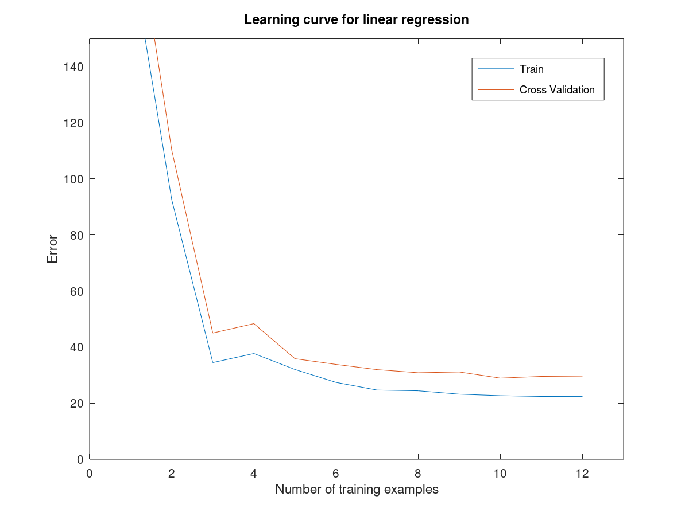

## Deciding what to try next

Debugging wehn given a large number of errors in the predictions -
1. we cantake more samples
2. Try a smaller set of features
3. polynomial features add
4. increasing or devreasing lambda.

## Evaluating a hypothesis

1. deviding them into training and validation sets
2. to avoid oerfitting keeping the training error to beloew and test error tobe 
3. steps : learn parameter theta from yraining data,
compute thte test error
compute tthe misclassification

## Model selection and validation

1. In model seelection we also choose a value d whichc is s adegree of polynomial.
instead we use a 60 20 20 split between training cross validation and test set

## Diagnosing Bias vs Variance

## Regularisaton vs bias and variance

High regularisation means that underfittings high bias,low means overfitting high variance.

## Learning curves
Effect oof increasing the training parameters on:

High bias

High variance

## Deciding what to do in case of  overfitting and underfitting

    Getting more training examples: Fixes high variance

    Trying smaller sets of features: Fixes high variance

    Adding features: Fixes high bias

    Adding polynomial features: Fixes high bias

    Decreasing λ: Fixes high bias

    Increasing λ: Fixes high variance.

## Failed test:

suspect questions:

# Exercise :

The problem:

Wrong regression:

Wrong training curve by me:

Correct curve after not using full validation and training curve for training error

Poly curve 0 lambda

Poly regression 0 lambda

Poly fit at 1 lambda

poly fit at 100 lambda

Validation at optimum lambda

OPtional exercise 3.5 needs to be done. Done with random values of i,
gives this:

## Building a spamclasssifier

So how could you spend your time to improve the accuracy of this classifier?

    Collect lots of data (for example "honeypot" project but doesn't always work)
    Develop sophisticated features (for example: using email header data in spam emails)
    Develop algorithms to process your input in different ways (recognizing misspellings in spam).

### Error analysis
The recommended approach to solving machine learning problems is to:

    Start with a simple algorithm, implement it quickly, and test it early on your cross validation data.
    Plot learning curves to decide if more data, more features, etc. are likely to help.
    Manually examine the errors on examples in the cross validation set and try to spot a trend where most of the errors were made.

### Error metrics for skewed classes

Skewed classes - where one instance of class is more likely to come than the other its is called skewed claass

Precision vs recall

Precision : of all te prediction we have y=1 how many actually have cancer

= true positive / true positive + false positive

Recall : of all the patients that have cancer how many did we derect as having cancer

= true positive /true positive + false negative

## Trading off precision and recall

F1 score = 2 * P * R / (P+ R)

Measure precision (P) and recall (R) on the cross validation set and choose the value of threshold which maximizes 2PRP+R2\frac{PR}{P+R}2P+RPR​

## Data for machine learning

More data the better.
accuracy = (true positives + true negatives) / total_examples

## Exercise

precision = 85/975
recall = 85 /100
F2score = 0.1581

