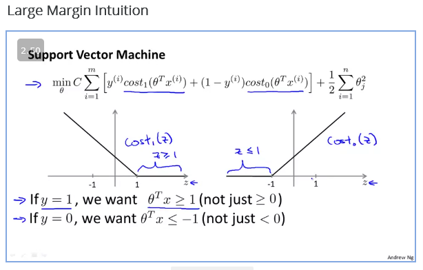
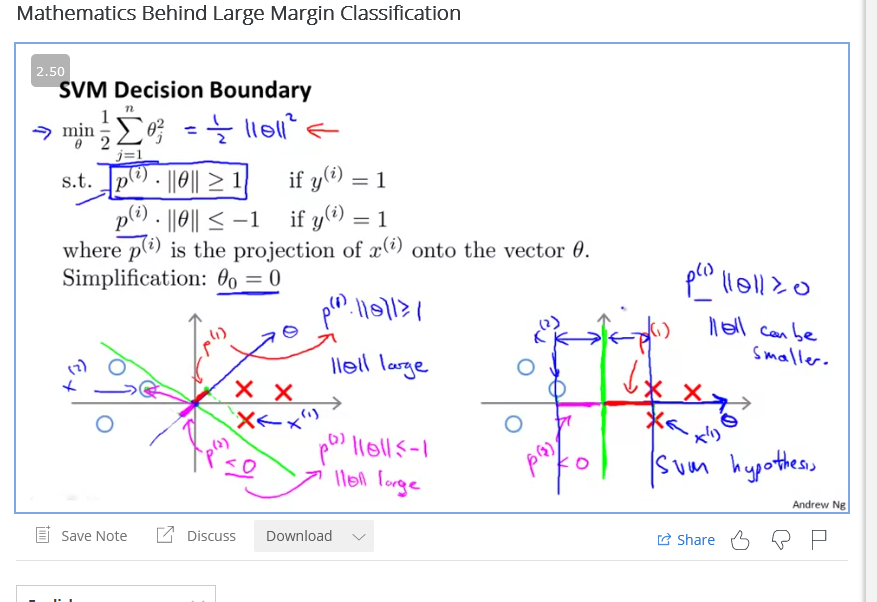
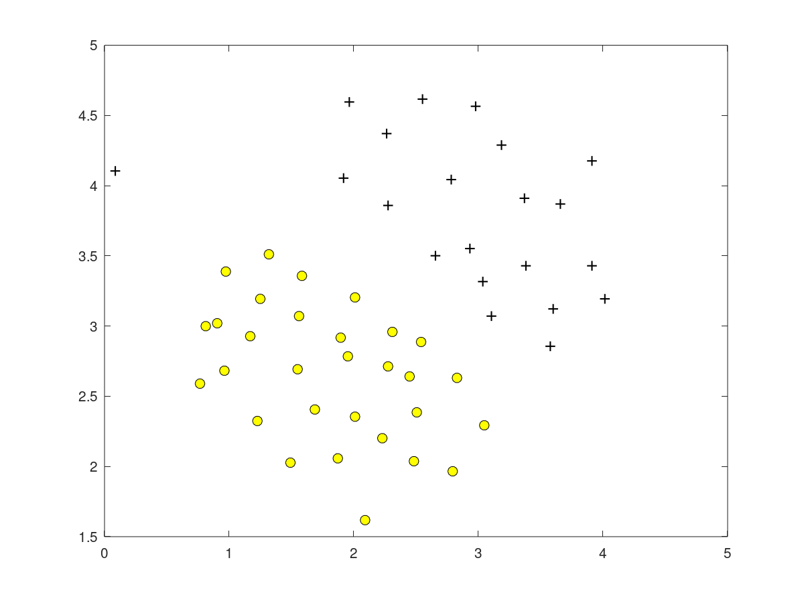
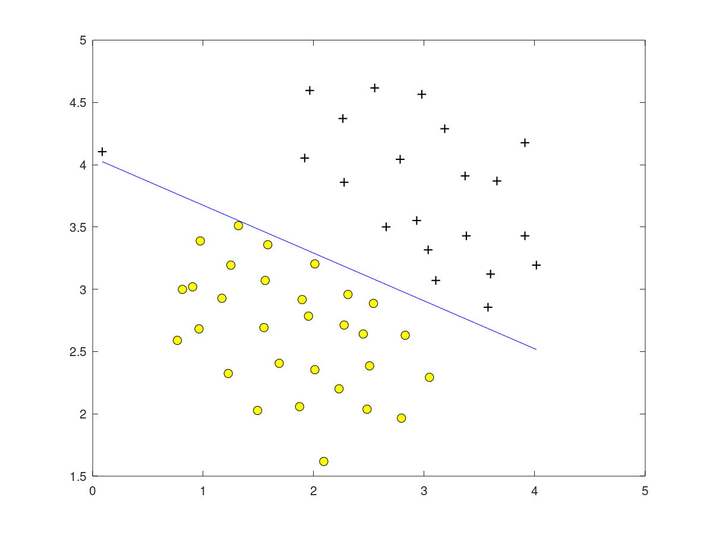
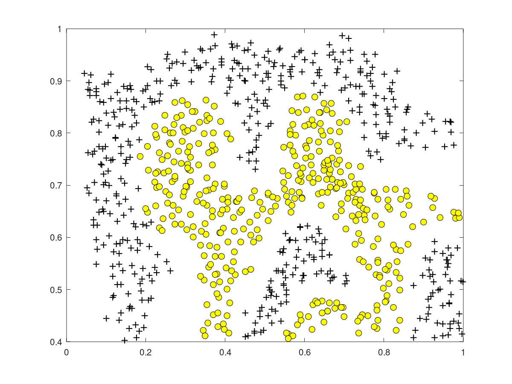
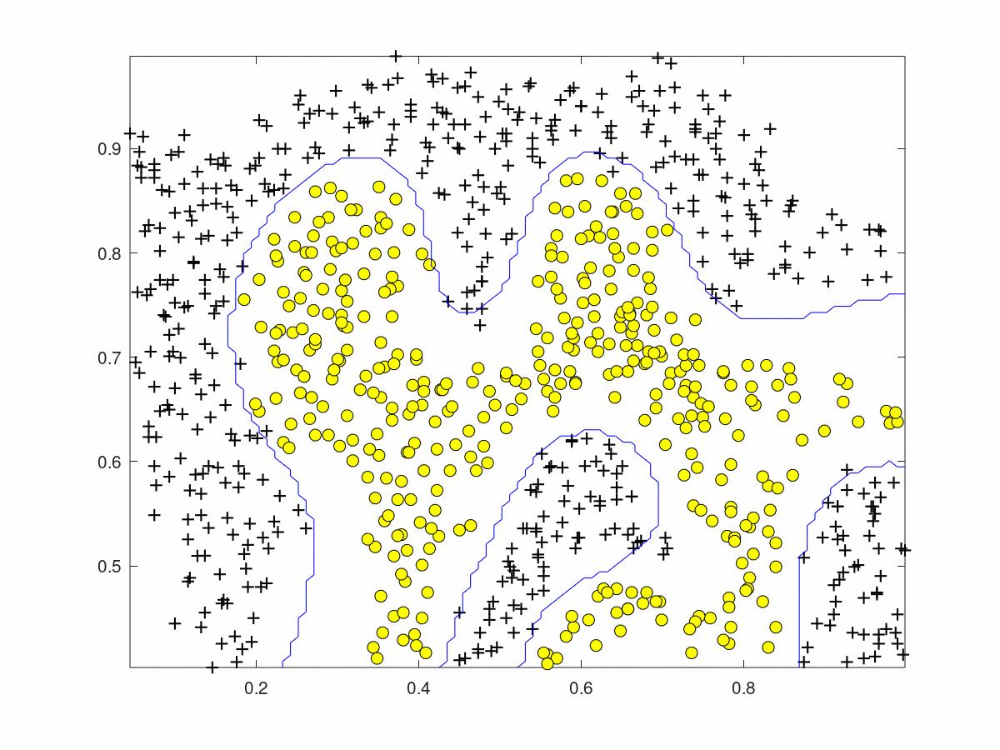
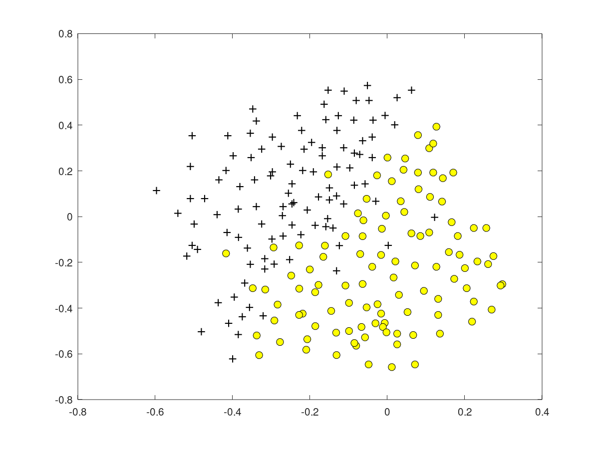
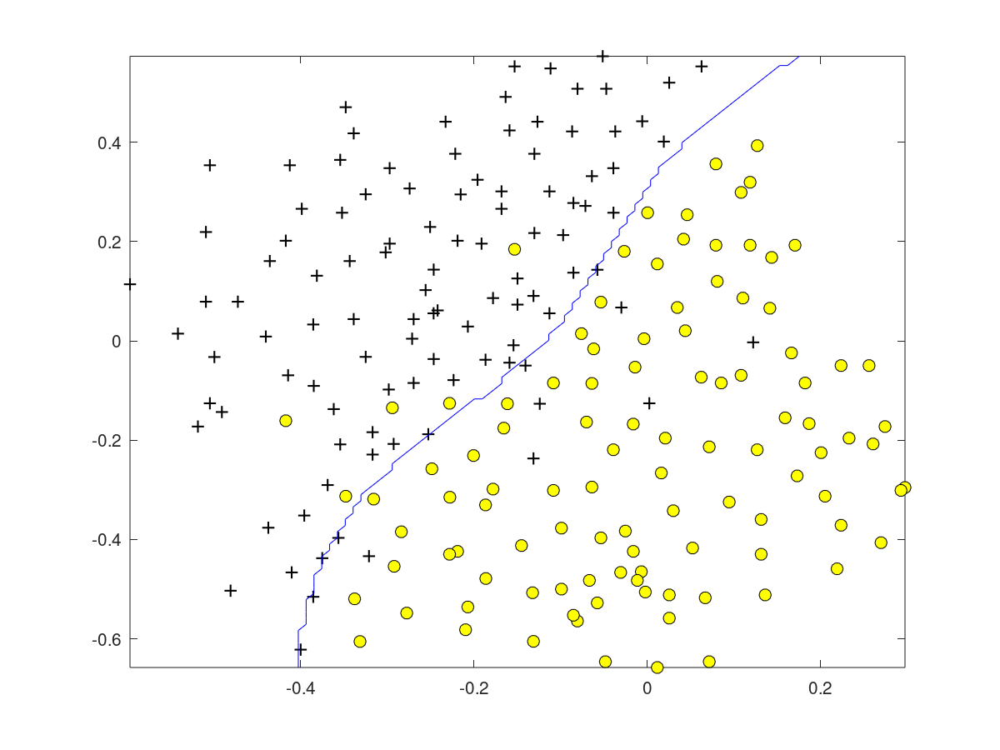

## Support vector machine
Notes: https://www.coursera.org/learn/machine-learning/resources/Es9Qo

### Optimisation objective

### Large Margin intuition

C controls how much the optimisation is affected by the outliers.

### mathematics begind large margin classfication

Why the best boundary is chosen

### Kernels 1

Is there somebetter representation thna the higher order polunomials

### Kernel 2

we choose as many landmarks as there are training sets.

### Using an svm

if we don'tspecify any kernel then it will take every function f to be a landmark and theta0 + theta1*x1 + theta2 *x2... as the kernel function

use feature scaling before using gaussian kernel.

NOt all similary functions were created equal, some diverge insteadof converging. Then we have a technical condition called mercer theoram to sat

1. Polinomial kernel.
2. String kernel, chi-square

Multi class classification
one vs all or using off the shelf multi class

logistic vs SVM

if n >= m , logistic
if n is small and m is intermediate
if n is small and m is large then use more features witohut

### from notes

Choosing SVM Parameters

Choosing C (recall that C=1λC = \dfrac{1}{\lambda}C=λ1​

    If C is large, then we get higher variance/lower bias
    If C is small, then we get lower variance/higher bias

The other parameter we must choose is σ2σ^2σ2 from the Gaussian Kernel function:

With a large σ2σ^2σ2, the features fi vary more smoothly, causing higher bias and lower variance.

With a small σ2σ^2σ2, the features fi vary less smoothly, causing lower bias and higher variance.
Multi-class Classification

Many SVM libraries have multi-class classification built-in.

You can use the one-vs-all method just like we did for logistic regression, where y∈1,2,3,…,Ky \in {1,2,3,\dots,K}y∈1,2,3,…,K with Θ(1),Θ(2),…,Θ(K)\Theta^{(1)}, \Theta^{(2)}, \dots,\Theta{(K)}Θ(1),Θ(2),…,Θ(K). We pick class i with the largest (Θ(i))Tx(\Theta^{(i)})^Tx(Θ(i))Tx.

# Exercises

Need to modify for value of C and sigma.