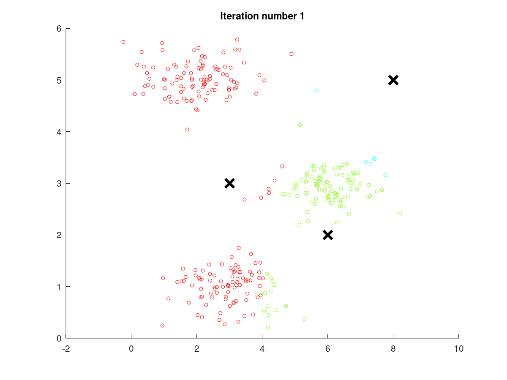

# Unsupervised learning

## Introduction
It is a clustering algorithm.

## K means algorithm

Takesa parameter K which is the numberof clusters
over training set X1 x2 x3 upto xm

Randomly initialise K cluster centroids mu1 mu2 and muk

Repeat {
    for i=1:m,
        C(i) = index(from 1 to k) of cluster centroid closest to x(i)
        C(i) is the value that minimises ||x(i) - mu(k)||.^ 2
        thisis the cluster assignment set
    for k=1:K
        mu(k) = average of points assigned to cluster k
    move the cluser
    mu(k) = average(all x(i) in teh cluster)/number of x(i)

}   

We eliminate the cluster if the cluster is wrongly assigned.
g\

## Optimisation objective

K means optimisation objective
c(i) = index of clister to which the example x(i) is currently assigned

mu(k) = ckuster centroid k
muc(i) = cluster centroid of cluster to which example x(i) has been assigned

the objective is to minimise 
1/m sum[1 to m](X(i) - muc(i)).^2

## Random initialisation

in this we randomly inita=ialise K means and compute the ost function and then choose the random value with lowest cost function

## choosing the umber of cluster

elbow method where the cost function is least
evaluate K means on a metric on how well it works on a later purpose

## Dimensionality reduction

### Motivation data compression

reducing the number of features by finding the correlation between the data

Suppose we apply dimensionality reduction to a dataset of m examples {x(1),x(2),…,x(m)}\{x^{(1)}, x^{(2)}, \dots, x^{(m)}\}{x(1),x(2),…,x(m)}, where x(i)∈Rnx^{(i)}\in\mathbb{R}^nx(i)∈Rn. As a result of this, we will get out:
A lower dimensional dataset {z(1),z(2),…,z(m)}\{z^{(1)}, z^{(2)},\dots, z^{(m)}\}{z(1),z(2),…,z(m)} of m examples where z(i)∈Rkz^{(i)} \in \mathbb{R}^kz(i)∈Rk for some value of kkk and k≤nk\leq nk≤n. 

### Motivation data visualisation

helps to plot data better.
And reduces the the data used.

## Principal component analysis

PCA tries to find the minimum vertical distance between the lines to map the data

### PCA algorithm
training set: x(1), x(2), x(3) ...

feature scaling / mean normalisation step
    mu(j) = 1/m * sum[1 to m] x(j)
    replace x(j) = x(j) - mu(j)

Reduce thedata from n dimensions to k dimension
compute the covariance matrix
sigma = 1/m sum[1 to n] x(i) x(i).T

compute the eignevectors of matric sigma
[U, S,V] = svd(sigma);

inU we will use the first K columns
U(:,1:k)
z = uk .T * X

# reconstruction from compressed representation
Xapprox = Ureduce . Z

# choosing the number of principal componenets

choosing k
typically we choose the k to be smallest value so that
1/m * sum[1 to m](X(i) - X(i)approx).^2/ 1/m *sum[1 to m] * x(i).^2 <= 0.01

so that 99 percent of the variance is retained

which is equivalent to calculating 
1- sum[1 to k](s(i))/ sum[1 to n](s(i)) <= 0.01

# advice
use PCA for speeding up training but not for regularisation

We use pca only when we have to do it

## Exercise

