# Anomaly detection

better notes :
https://www.holehouse.org/mlclass/15_Anomaly_Detection.html

## Motivatioin

if p(x) < epsilon then flag anomaly
p(x+1)>epsilon then its okay.

trying to test for new features

The epsilon value should be less fpr morenipp

## Gussian Distribusioon
the graph width would be lesser based on the valueo sigma 
in this case the value os sigma = 0.5
then sigma.^2 = 0.25
however area under the curve remains the same 
that is why th eheight incrases
increasing sigm aflattense the curve
changing the mu parameter will shift the graph to that x value

mu(j) = 1/m * sum(X(j))
sigma(j).^2 = 1/m * sum(X(j)- mu(j)).^2

## Anomaly finding algorithm

step 1 choose features x(i) that might be indicative of anomalous examples
step 2 fit parameters mu(1), mu(n) and sigma(1).^2 upto sigma(n).^2
given new examplex compute p(x)
p(x) = product(p(x(j)), mu(j), sigma(j).^2) = product (1/sq root(2 * pi) * sigma (j)) * exp(-(x(j) - mu(j)).^2)/2 * sigma.^2*(j)

if p(x) < epsilon then its an anomaly

## Developing and evaluating detection system

fit model p(x) on training set {x(1)....x(m)}
on a cross validation example predict y - 1 or zero
other metrics -  true positive,fase positie m false negative true negative, precision /Recall
f1 score

youalso use cross validation set to choose paprmaeter sigma

## Anomaly detection vs supervised learning

supervised learning to be used where we have a senseof what future positive examples 

Monitoring data in data science organisation

## Choosingfeatures to use

for non gaussian features, translate it into a gaussian function

Error analysis in a gaussian function
choose feature than creats a large value

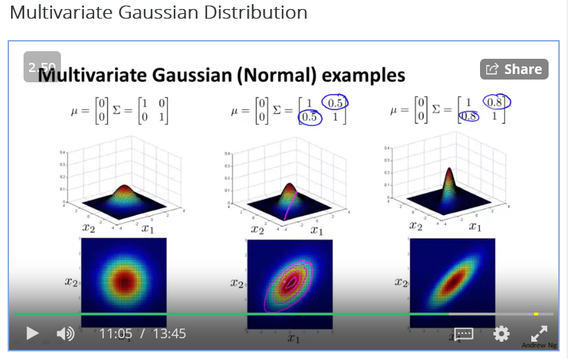

## multivariate gaussian distribution

We create a multivariate gaussian distrbution by modeling
We model p(x1) p(x2) all at one go
parameters : mybelongs to real numberand@

## Anomaly detection using gaussian multivaraite

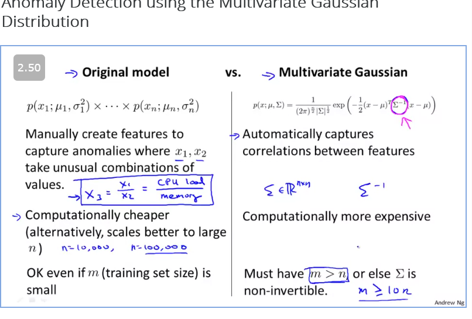

# Recommender systems

## Predicting movie rating
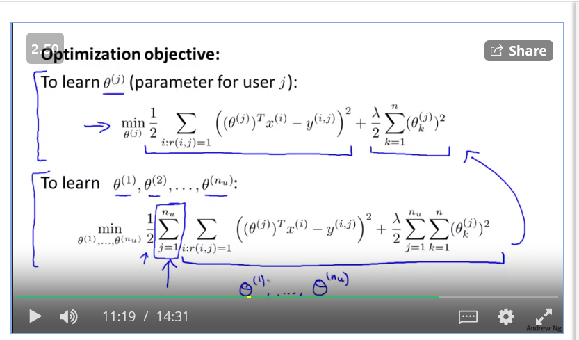

## Collaborative filtering
if you havex you can predict theta and if you hav theta you can predict x, each user is helping th esystem for universal imporivement of a sercice.
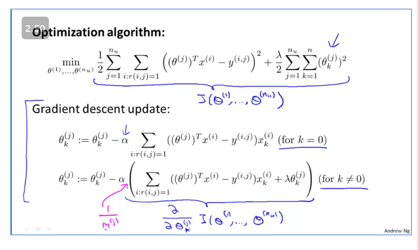
 
 

## Collaborative filtering algorithm

combining both finding theta and finding x
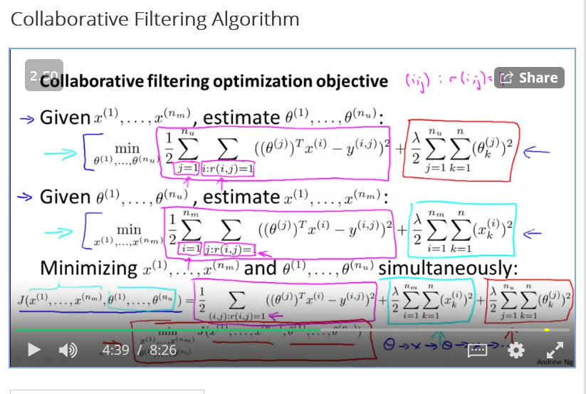

combining gradient descent
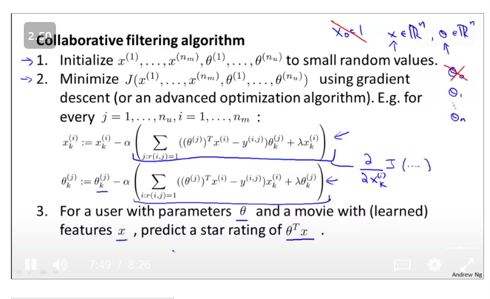

## Vectorisation implementation 

finding related movies :
finding movies with smallest difference between X(i) and X(j) = ||x(i) - x(j)||

## Mean normalisation

The best way to optimise would ebe setting every theta value to zero to minimise however that doesnt help us

we subtract the mean of data so that even if you have not givenany rating then still youll give averagerating

We have not used feature scaling because they are already on the same scale of zero to 5 stars.

# Quiz
Quiz was extra tough because i think i sleep walked through the lectures
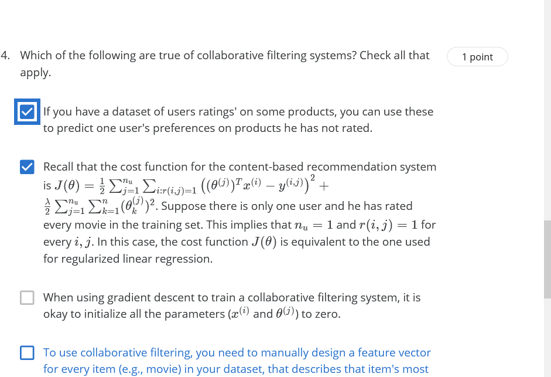
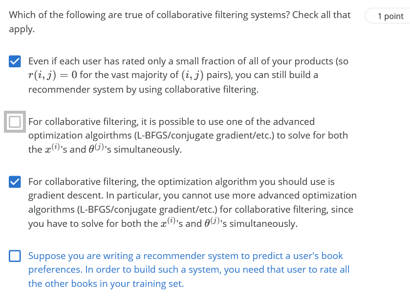
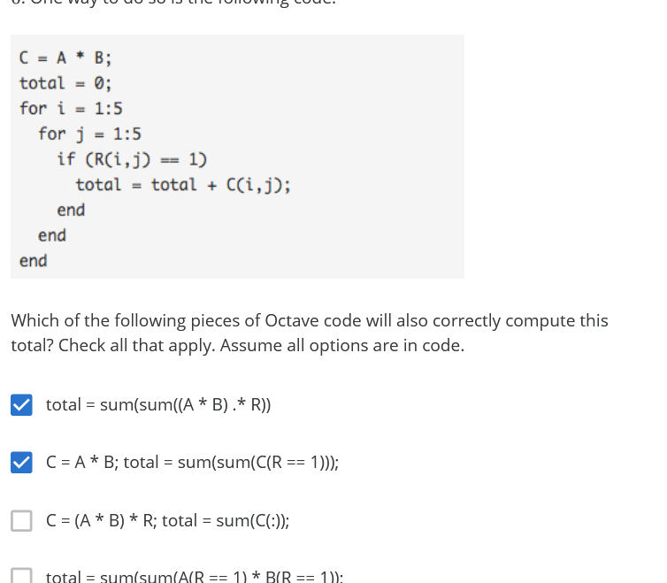
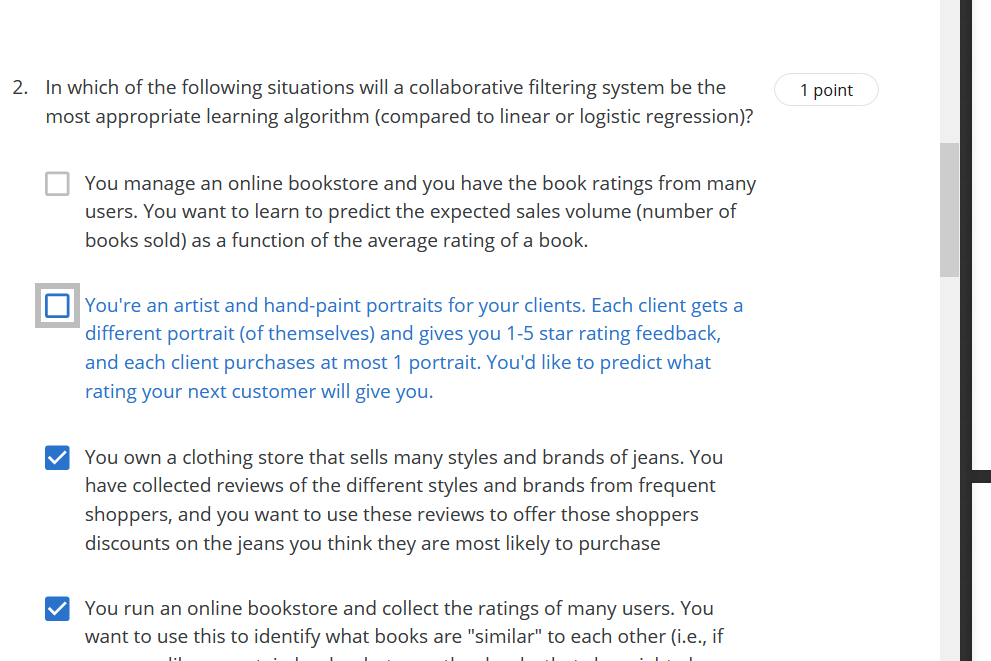
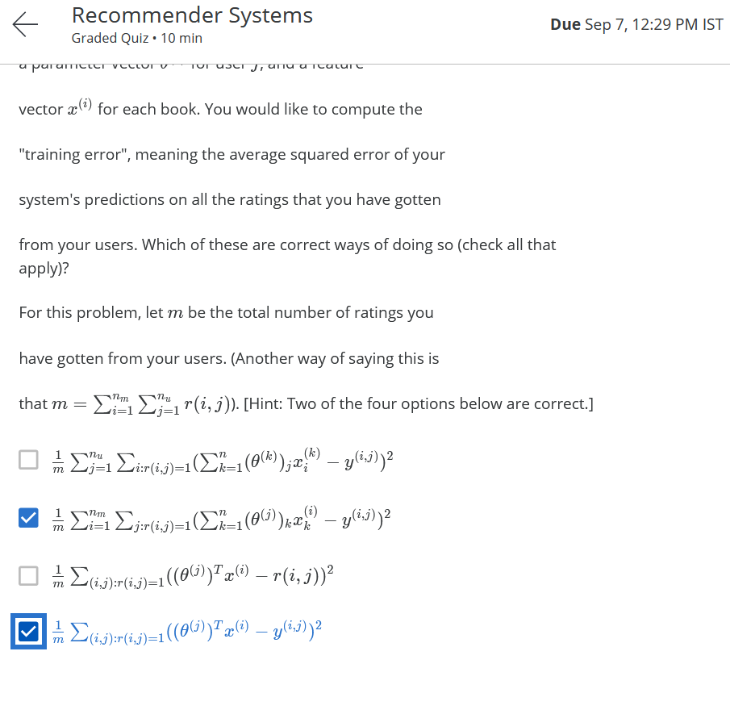
# Exercise

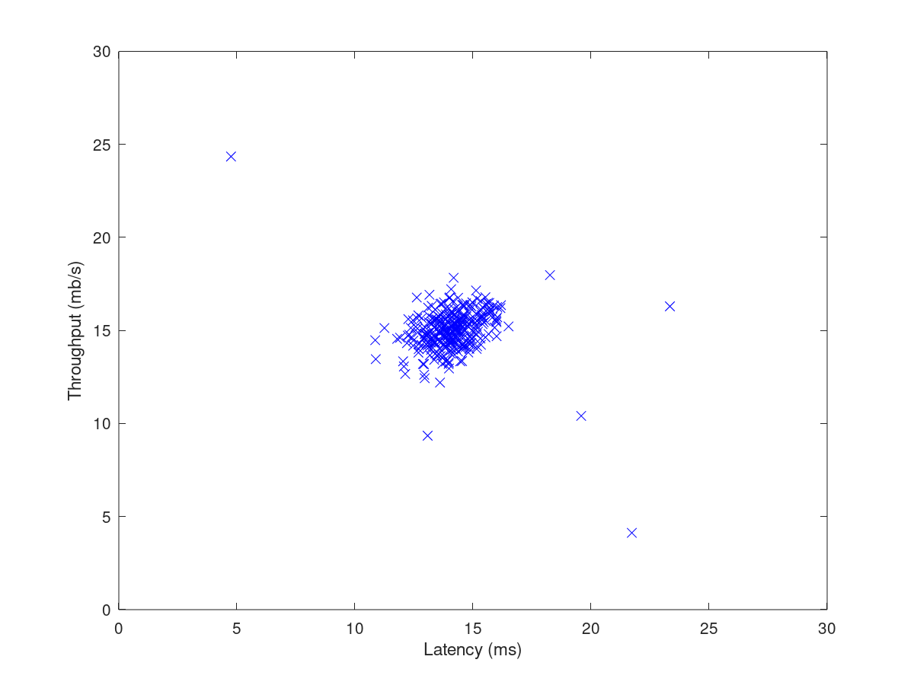

Gaussian estimate:
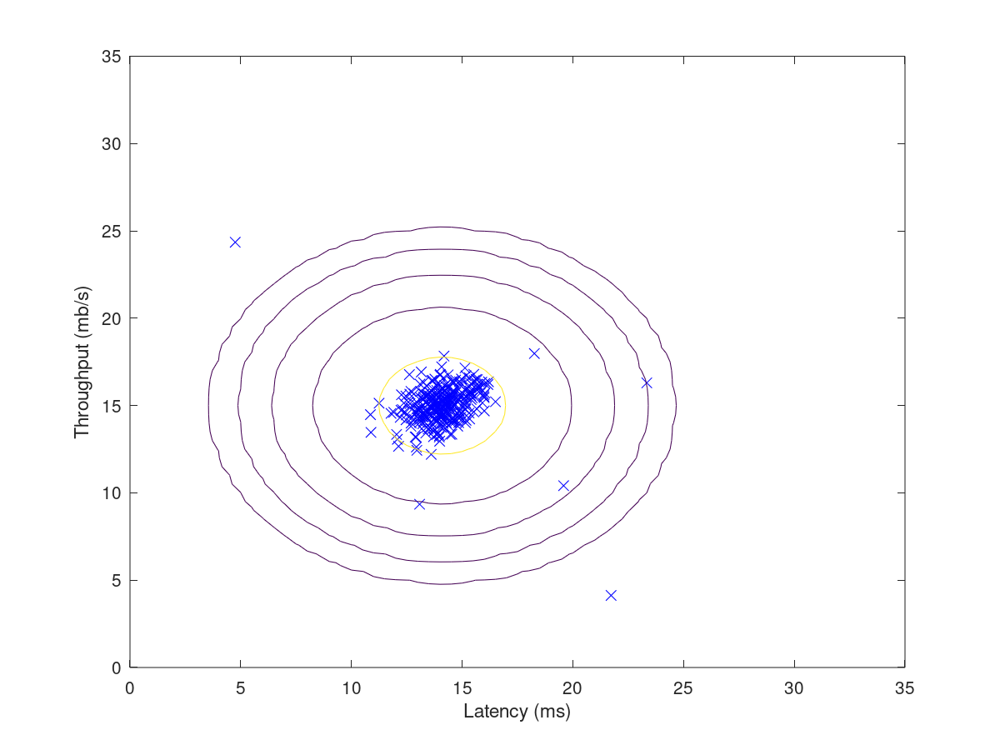

outliers:
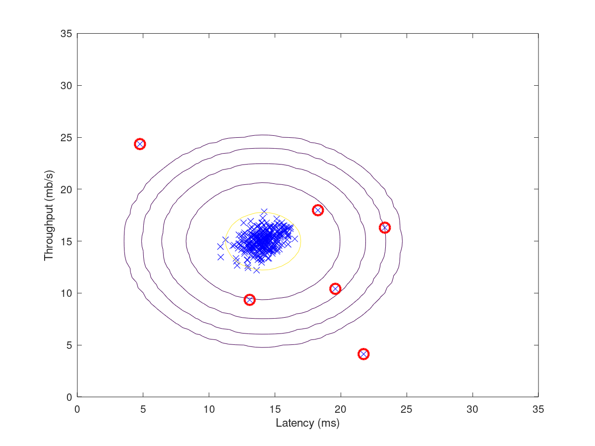

Movie Rating
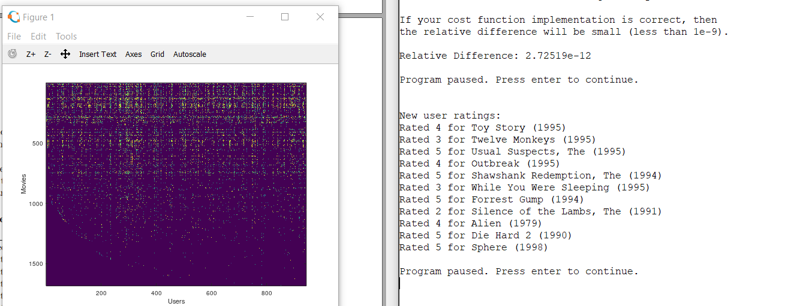

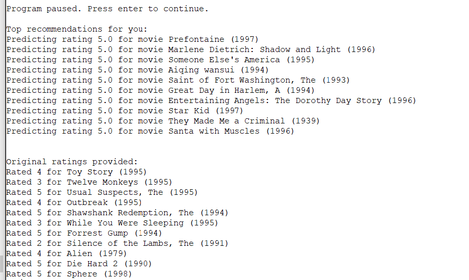

Iknow that collaborative filtering is something that i need to revisit.

